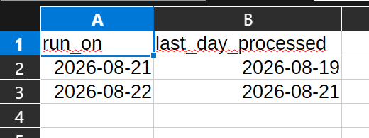

# Configuring My Quake Shakes

Once installed you need to set some configurations for you to get usable data.  This is almost entirely done via CSV files in the repository along with a big of research on Earthscope/IRIS & Google.

> [!IMPORTANT]
> All configuration files are located in the `./my-quake-shakes/SAIPy/config` folder

# Home Range

The `home_range.csv` file is where set the center of your search for earthquake events and the radius around it to search.  My Quake Shakes ship with Mt St Helens as the location to test with.

> [!WARNING]
> Only the last entry in home_range.csv is read. You can add as many as you like but it will only use the bottom most.

> [!NOTE]
> In theory to run multiple locales you can clone the repo multiple times and set `home_range.csv` in each one. Or edit the code to add multi-location option.


Create a simple entry with the `latitude` & `longitude` of your location you wish to monitor.  In the `radius_km` field enter the radius in kilometers from the eenter point to search for earthquake events. The `notes` section isn't used by the script but is just a method of giving a human readable title to a location.

Save.

# Sensor Locations

The `stations.csv` is the configuration file for what sensors you want to process.

> [!IMPORTANT]
> You can list as many stations as you like.  It only adds run time to the processing.

> [!NOTE]
> All fields are mandatory and specific based on IRIS/Earthscope information.

## Locating Sensor Data to Use

This demonstration will show how to access public data via the IRIS/Earthscope system. I believe SAIpy and Obspy can access other networks but I haven't figure out their nomenclature, etc.


> [!CAUTION]
> Only IRIS/Earthscope sources will be supported officially. 

### Step 1 - Search IRIS/Earthscope

* Open the [IRIS Station Monitor](https://www.iris.edu/app/station_monitor/) website


To start enter a zip code you want to find sensors in.  In the Blue Box in the example the zip code for Mt St Helens was used.  You can see the sensor options pop up.  In this case the East Dome sensor was highlighted and selected.

### How to Choose a Sensor?

In the end this is up to you but there are some things to consider.

1) How close is it to the location you want to monitor?
2) Who is running the sensor?
  * Primarily this is a professional sensor vs citizen science project question
3) What kind of sensor is it?
  * This is the biggest question and will be covered below in the [Types of Sensors Nomenclature](#types-of-sensors-nomenclature) section for details
  
### Step 2 - Enter Correct Settings from the IRIS/Earthscope Stations Page


You will need to collect some of the fields from the IRIS/Earthscope page for each sensor you'd like to use.

`wsp` will always be `EARTHSCOPE` for sensors (formerly `IRIS` -- this will work but give a warning on each run)

`network` and `station` can be gathered from the initial page.  The station ID is located in the yellow box at the top. In the follow example it is `EDM`. The `network` is a bit trickier and in this example it is UW which is located in the title.

You may need to cross check the code with the official [FDSN Network list](https://fdsn.org/networks/?initial=X&page=2&sort=-name).


`location` is always `*` as best I can tell at this time.

`station_hr_name` is a human readable name you can set.  This was at one point used in displaying in the ics but currently is not used.  Still a good way to know what is what in human readable form.  This is a free field you choose to set.

`channel`  this is essentially which set and  type of sensors do you want to download and process.  The view available options for the station select scroll down and click on the Advanced Features tab (Orange Box) then scroll down to the Channels option (Purple Box).


Here is where the 'fun' starts....

What do these mean? And how to translate them to your `stations.csv`.  Let's start with part two:

Enter the first two characters followed by an asterisk in your `stations.csv`.  In the above example `HH*` was entered into the `stations.csv`

What you just told the SAIPy / IRIS download is that you want to use ALL three channels that start with HH.  But what does HH mean and why don't we are care about the last character?

### Types of Sensors Nomenclature

The 3 characters are the SEED Code for the channels. Basically each letter of the 3 stands for something.

* Character 1: Band Code -- Basically the sampling rate of the device and how fast it reacts
* Character 2: Instrument Code -- Basically what kind of sensors are in the array
* Character 3: Orientation of the Sensor on the Channel -- Often (N)orth-South, (E)ast-West, (Z)Vertical

So taking the one above we have HH* which means use the Broad Band, High Gain Seismometer, and use all 3 orientations. The '*' is a wildcard.

For more detailed information on this convention see [this page on the IRIS website.](https://ds.iris.edu/ds/nodes/dmc/data/formats/seed-channel-naming/) It is very thorough.  

The pairings I've seen so far are:

* HH* - Broad band High sensitivity (ie small earth quakes) seismometer
* HN* - Broad band Low sensitivity (ie - so doesn't clip large earthquakes) accelerometer
* EN* - Extremely Short Period accelerometer

This is where selecting what station or what set of sensors is up to you.  It seems the Hxx is better than the Exx and whether or not you are more interested in the bigger or smaller earthquakes for the xHx vs xNx for the second character.  And where the citizen science projects only seem to have the Exx sensors. I tend to be most interested in HH* sensors but if an EN* sensor is closer I'll add that too.

Repeat this process for each station you want to process and monitor.

### Step 3 - Start Date

My Quake Shakes uses the `run_dates.csv` to know which date to start proessing.  By default this is empty and you need to add a start entry.



All fields are in the following format:

`FULL_YEAR-2_DIGITS_MONTH-DATE` in the above example cell A1 is: `2026-08-21` for August 21, 2026


There are two columns:
`run_on` - This is just the last time the script ran and is for human readable log. This date does NOT impact the script. Enter today's date.
`last_day_processed` - This is the important date.  The script will download earthquake events the day after is entered here.   Enter the day BEFORE the day you'd like to process.  It will process all dates up until YESTERDAY.

> [!TIP]
> It is recommended to process no more than a week prior. If the script fails you lose all prior dates.  This prevents issues on a day failure basis but on a long processing it can cause much loss.

# RUN Time

That is everything.  Assuming all as been setup correctly you can manually give it a test run by:

`./run.sh`

## Output location

The final `my_quake_shakes.ics` file is written to the same folder it is run in.

# Home Assistant Integration

By default this card setup shows the past 30 days of events and does not dim out past events -- which these all will be. In addition to some other formating options.

* Install [Atomic Calendar Revive](https://github.com/totaldebug/atomic-calendar-revive) via HACS
* Enable [Remote Calendar](https://www.home-assistant.io/integrations/remote_calendar/) Integration
  * URL: `http://YOUR.IP.ADDR.ESS/my-quake-shakes.ics` or your path to the ics file on your webserver if it is different
* Create a card using the `my_quake_shakes_homeassistant_card.yaml` file
  - [ ] Edit the sensor name to match your Remote Calendar name you created above 

# Advanced Configuration Options

> [!IMPORTANT]
> These options are more like idea guidelines than officially supported or completely documented features.  They are features I am using but are not part of the core My Quake Shake program.

## Custom actions

In the `./my-quake-shakes/SAIPy/config` folder there is a bash script called `custom-actions.sh`.  This script runs at the end of the `run.sh` script.  You can add any actions you'd like to run after the My Quake Shakes core script runs.  

One example is ...

## FTP ics File

In the `custom-actions.sh` file there is a curl command that will upload the ics file to a ftp server of your choice.  To use you will need a working FTP server & curl installed (`sudo apt install curl`).  Then uncomment the curl line below in `custom-actions.sh`. And add your ip address, username, and password:

```
# FTP to Home Assistant
# Enable FTP server and a user with access to the the config share
curl -T my-quake-shakes.ics ftp://HA.IP.ADD.RESS/config/www/ --user username:password
```

I use this because I am serving the ics file using the Home Assistant built in web server and because the machine that runs My Quake Shakes goes to sleep in between runs and Home Assistant likes the ics to be always available for the 'Remote Calendar' plugin.

That brings us to ....

## Suspend My Quake Shakes Host After Running My Quake Shakes

At the end of the `run.sh` file there is a command to put the host to sleep when the script is done running. This is for systemd enabled hosts AND yu have to enable passwordless use of the systemctl suspend command. That is beyond the scope of this project.

To enable uncommend the `systemctl suspend` line at the end of `run.sh` as well as the `sleep 30s` line so it gives a small pause before sending the sleep command:

```
# Puts computer to sleep once the script has run - systemd hosts
sleep 30s
systemctl suspend
```

I have my Home Assistant server set to run a Wake On Lan command every 24 hours to the host machine of the Mhy Quake Shakes service.  So after it sleeps it will be woken up once a day to run.

## API Run My Quake Shakes

This is the last piece of the energy saving sleep when not in use of the My Quake Shakes host machine.  After it has been woken up via WOL magic packet  I used [webhook](https://github.com/adnanh/webhook) to create a simple API that triggers the `run.sh` script on demand.  I use Home Assistant to send Wake on Lan, Wait 5 Minutes, then trigger the API to run the script.  The My Quake Shakes script then runs, uploads the ics file to the Home Assistant Server via FTP, and then goes back to sleep.

> [!IMPORTANT]
> THIS IS AN ADVANCED FEATURE. It takes more familiarity with linux and editing config files, and using systemd services to implement. Not ever commmand is documented here. Only the general idea and core files are documented.

### Step 1 - Edit `.\my-quake-shakes\SAIPy\hooks.json` File

Included in this repo are the `hooks.json` file which contains the core commands for the API endpoint to run.  You will need to edit this file to the correct path where My Quake Shakes is installed. If you installed it into your home directory then likely you will just need to put in your username in the placeholder.  But that may not be true.  The `hooks.json` file stays in the same location as you installed My Quake Shakes files (in the SAIPy folder).

### Step 2 - Enabled webhook Service

You will need to edit the `webhook.service` file with the correct path to your `hooks.json`file and user to run the command under. Then copy it to the correct location for systemd services, enable it, and start it. Once started and running if everything is working you can trigger the `run.sh` script via the following url:

`http://YOUR.IP.ADD.RESS:9000/hooks/run-my-quake-shakes`

OR

`http://HOSTNAME:9000/hooks/run-my-quake-shakes`


