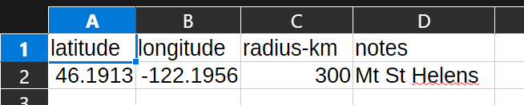
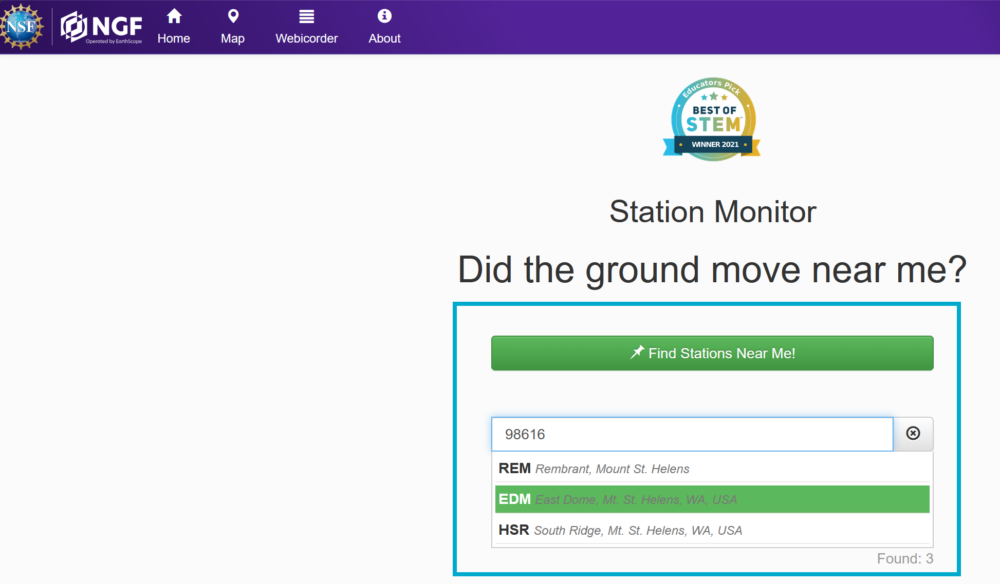
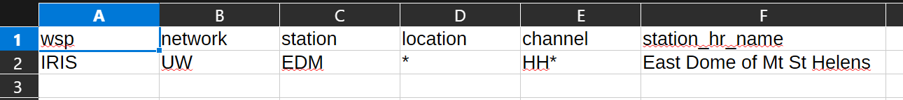
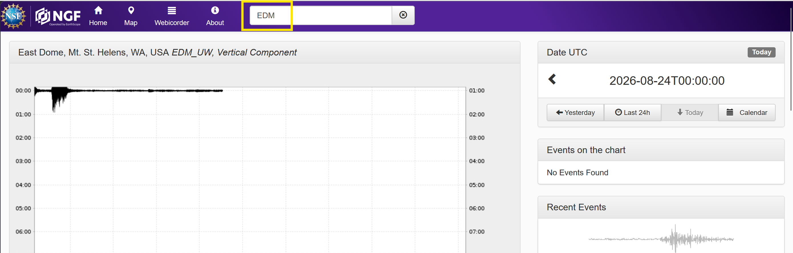
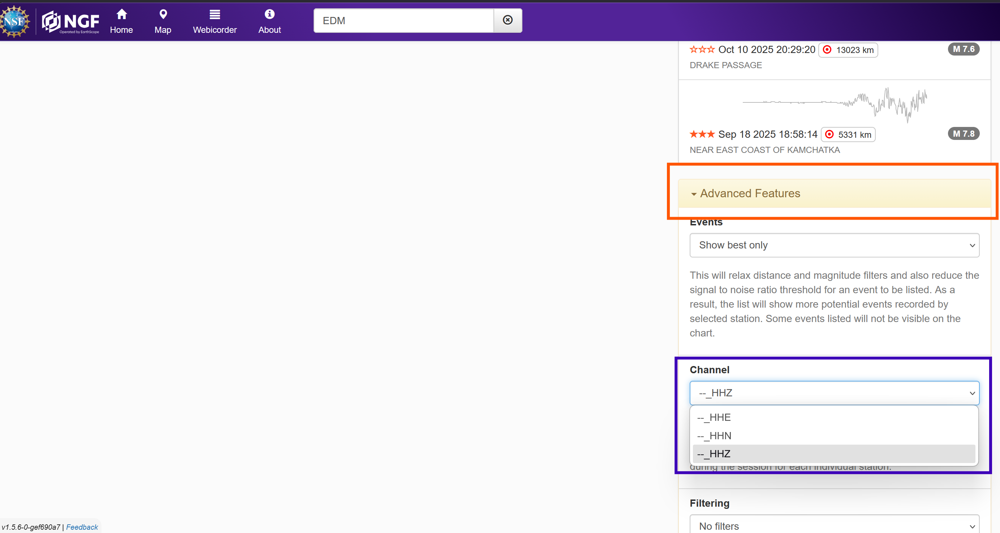

# Configuring My Quake Shakes

Once installed you need to set some configurations for you to get usable data.  This is almost entirely done via CSV files in the repository along with a big of research on IRIS / Google.

# Home Range

The `home_range.csv` file is where set the center of your search for earthquake events and the radius around it to search.  My Quake Shakes ship with Mt St Helens as the location to test with.

> [!WARNING]
> Only the last entry in home_range.csv is read. You can add as many as you like but it will only use the bottom most.

> [!NOTE]
> In theory to run multiple locales you can clone the repo multiple times and set `home_range.csv` in each one. Or edit the code to add multi-location option.

Create a simple entry with the `latitude` & `longitude` of your location you wish to monitor.  In the `radius_km` field enter the radius in kilometers from the eenter point to search for earthquake events. The `notes` section isn't used by the script but is just a method of giving a human readable title to a location.

Save.

# Sensor Locations

The `stations.csv` is the configuration file for what sensors you want to process.

> [!IMPORTANT]
> You can list as many stations as you like.  It only adds run time to the processing.

> [!NOTE]
> All fields are mandatory and specific based on IRIS/Earthscope information.

## Locating Sensor Data to Use

This demonstration will show how to access public data via the IRIS/Earthscope system. I believe SAIpy and Obspy can access other networks but I haven't figure out their nomenclature, etc.

> [!CAUTION]
> Only IRIS/Earthscope sources will be supported officially. 

### Step 1 - Search IRIS/Earthscope

* Open the [IRIS Station Monitor](https://www.iris.edu/app/station_monitor/) website

To start enter a zip code you want to find sensors in.  In the Blue Box in the example the zip code for Mt St Helens was used.  You can see the sensor options pop up.  In this case the East Dome sensor was highlighted and selected.

### How to Choose a Sensor?

In the end this is up to you but there are some things to consider.

1) How close is it to the location you want to monitor?
2) Who is running the sensor?
  1) Primarily this is a professional sensor vs citizen science project question
3) What kind of sensor is it?
  1) This is the biggest question and will be covered below in the Types of Sensors Nomenclature section for details
  
### Step 2 - Enter Correct Settings from the IRIS Stations Page

You will need to collect some of the fields from the IRIS page for each sensor you'd like to use.

`wsp` will always be `IRIS` for sensors

`network` and `station` can be gathered from the initial page.  The station ID is located in the yellow box at the top. In the follow example it is `EDM`. The `network` is a bit trickier and in this example it is UW which is located in the title.

You may need to cross check the code with the official [FDSN Network list](https://fdsn.org/networks/?initial=X&page=2&sort=-name).

`location` is always `*` as best I can tell at this time.

`station_hr_name` is a human readable name you can set.  This was at one point used in displaying in the ics but currently is not used.  Still a good way to know what is what in human readable form.  This is a free field you choose to set.

'channel'  this is essentially which set and  type of sensors do you want to download and process.  The view available options for the station select scroll down and click on the Advanced Features tab (Orange Box) then scroll down to the Channels option (Purple Box).

Here is where the 'fun' starts....

What do these mean? And how to translate them to your `stations.csv`.  Let's start with part two:

Enter the first two characters followed by an asterisk in your `stations.csv`.  In the above example `HH*` was entered into the `stations.csv`

What you just told the SAIpy / IRIS download is that you want to use ALL three channels that start with HH.  But what does HH mean and why don't we are about the last character?

The 3 characters are the SEED Code for the channels. Basically each letter of the 3 stands for something.

* Character 1: Band Code -- Basically the sampling rate of the device and how fast it reacts
* Character 2: Instrument Code -- Basically what kind of sensors are in the array
* Character 3: Orientation of the Sensor on the Channel -- Often (N)orth-South, (E)ast-West, (Z)Vertical

So taking the one above we have HH* which means use the High Sensitvity, High Gain Seismometer, and use all 3 orientations. The *' is a wildcard.

For more detailed information on this convention see [this page on the IRIS website.](https://ds.iris.edu/ds/nodes/dmc/data/formats/seed-channel-naming/) It is very thorough.  

The pairings I've seen so far are:

HH* - Broad band High sensitivity (ie small earth quakes) seismometer
HN* - Broad band Low sensitivity (ie - so doesn't clip large earthquakes) accelerometer
EN* - Extremely Short Period accelerometer

This is where selecting what station or what set of sensors is up to you.  It seems the H is better than the E and whether or not you are more interested in the bigger or smaller earthquakes for the H vs N for the second character.  And where the citizen science projects only seem to have the Exx sensors. I tend to be most interested in HH* sensors but if an EN* sesnor is closer I'll add that too.

Repeat this process for each station you want to process and monitor.