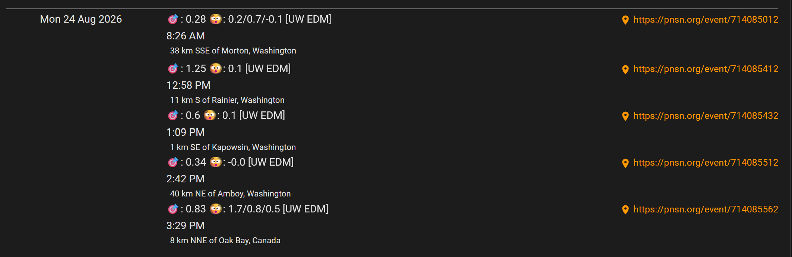
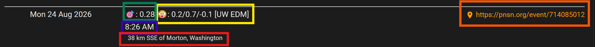

# To Do Before releasing to Main
- [X] Get basic SAIpy working and running
- [X] Integrate USGS Event Download
- [X] Auto-calculate time for SAIpy / IRIS download from USGS Event data
- [X] Automate rolling date so only dates unprocessed get download and processed
- [X] Create functional loop to process event data and feed it to SAIpy
- [X] Create functional error trap so if a download from IRIS gives a momentary connection error the script tries again.
   - [X] Instead of terminating the entire script as it was.
- [X] Create PNSN links from event numbers from USGS
- [X] Create functional ics calendar entries
- [X] Hone ics calendar entries to display data most usefully
- [X] Filter events to only create ics events for events that locally were sensed. 
  - [X] Prevent overwhelm of ics data / viewing (plenty of other ways to see quakes that happened)
- [X] Memory manage python. 
  - [ ] Right now python doesn't release ram from each SAIpy event run.  
  - [ ] Goal is to make each run a separate process so when done memory goes back into OS pool.  
  - [ ] In theory this means we would only need about 4GB of available memory at any time vs 32 GB capping out on 2 days of events and killing the process.
  - [ ] Hmmm got it cycling into it's own processes BUT the package from SAIpy is already has child processes
  - [X] Rewrote it using bash for the USGS download and looping so each event is a seperate python instance and the max RAM is about 4 GB for 15 minute sample
- [X] URL field seems to be .... wrong check assumptions on id information
  - [X] Seems ok - USGS vs PNSN description are different  
- [ ] Consider adding GeoJSON output to use on a map in Home Assistant in addition to calendar method
- [ ] Consider that if the script is interupted events will be written but it will run again as the final date isn't written until the end
- [ ] Clean up the code
  - [X] Pass 1 done
- [ ] Confirm documentation is done and accurate

# My Quake Shakes Introduction

The Earth is ALWAYS moving even if we as humans don't notice it - most of the time.  In general the movement we notice are bigger earthquakes anything from a small rattle in the building to much more destructive events. 

In earthquake prone regions such as the Pacific Northwest of the US there are large sensor networks to detect earthquakes.  More recently there are also citizen science projects that allow you to add a sensor to one of the networks yourself.  It is possible to go look up earthquake events on sites like USGS or PNSN and you can get a lot of data from those sites but primarily it is about the location and magnitude at the epicenter.  It is nice to know a 2.5 earthquake happened 100 miles away but I was curious about is ....

... how much did my house shake? Could I have felt it?  What shook but I couldn't feel?

One option is the aforementioned citizen science sensor monitors but they are very costly for a passing curiosity (~USD$1000).  The other options is lower sensitivity sensors that are cheaper but less accurate.  So what is a curious person supposed to do if they are feeling financially cheap but still curious?

# Create "My Quake Shakes" Of Course



This tool downloads and processes raw seismic data, processes it to calculate the local magnitude, then packages it in an ics calendar file for easy viewing in any calendar application.  My focus was putting it into a Home Assistant dashboard which is easy enough using the "Remote Calendar" integration and an Atomic Calendar Revive card. 

> [!IMPORTANT]
> And to be **VERY** clear -- all the hard stuff in this project was done by others. Not me. All I did was make a wrapper to put around it and to publish the data in a way I found useful: a calendar view.

So all serious credit goes to the follow tools/projects:

## USGS Earthquake Event API

USGS has a free API based service that allows us to say "Give me all earthquake events" in an X km radius around a location.  While it sounds cool to be like "Ohhh I detected an earthquake the big networks didn't" the reality is two fold: any sensor we have is going to singular and less precise than the professional ones. So the chance of false positives is fairly high to know if a shake is an earthquake or a "I dropped a book on the floor" or a "truck drove by". There is a reason the professionals use a whole network of sensors and no just a single one.

And most importantly this allowed a major reduction in data to process with the AI model so this can reasonable run on a decent enough CPU only machine. Whew.

## Earthscope/IRIS & Raw Waveform Data

Now the 'fun' thing is through services like [Earthscope/IRIS](https://www.iris.edu/app/station_monitor/) you are able to see what detector stations are close to you AND download the raw waveform data of the sensors.  Which is super cool AND also super not immediately helpful as those wave forms are complete and local magnitudes aren't provided with them. So excellent I can ID what is the closest station to me and I can get the raw data but I still don't know the how much my building shook and what I didn't feel yet. Rats.

## SAIpy - AI Model Tool

Enter [SAIpy](https://github.com/srivastavaresearchgroup/SAIPy).  This is a very cool [published research project](https://www.sciencedirect.com/science/article/pii/S0098300424001699) that uses AI models to detect earthquakes AND calculate local magnitude from a SINGLE set of sensors.  AND it has built in ability to directly download from IRIS/Earthscope as long as you provide the proper station information. Oh we can do that.

I tried a few other tools without any luck.  SAIpy ended up working for me. I can't say if it is the best or anything like that as earthquake science is terribly complex but I can say I was able to get it to give me what I wanted. So I approve of it!  If you want some insight into the science of earthquake magnitude calculations [this article on the Pacific Northwest Seismic Network](https://pnsn.org/education/seismology/magnitude-intensity) website was very interesting.

> [!CAUTION]
> While it is cool to use AI it does use **EVERY AVAIABLE PROCESSOR CORE** and requires ~3 GB of free RAM for every 15 minutes of raw data (default settings).  Which means it will run on slower cpu's it may take a prohibitively long time to run. While RAM is not negotiable but is directly porportional to raw data sample size.

More details of these resource usages can be found in the DevNotes section.   But the good news is My Quake Shake setup takes care to minimize all of the impacts for you.

## Viewing Output

So the above tools will output images and CSVs of data which is great but it isn't centralized or easy to digest.  That is where an ics calendar comes into play. I started by writing in a SQLite database and it worked just fine but the output was really just a table. Sufficient but not super clear.  I really just wanted to know what the official magnitude and epicenter location are compared to what my house may have felt. I eventually landed on the idea of a calendar 'meeting' with all the information I wanted in it. That makes display super simple -- relatively. The other nice thing is USGS labels each earthquake event with an unique ID and PNSN has a page for each event.  So I included a link in the location  field of the calendar event to links directly to WAY more information that I could display, calculate, or understand.



* 🎯: Displays the official magnitude from the USGS website (🟩 Green Box)
* 🫨: Displays the local magnitude at the listed station(s) (🟨 Yellow Boxes)
* Local Time of Event (🟪 Purple Box)
  * ics is written in UTC but the client will most often change it to your local time zone -- built in correction! YAY!
* USGS Location Description (🟥 Red Box)
* PNSN link to the event (🟧 Orange Box)

> [!NOTE]
> The description provided by USGS does **NOT** always match the description on the PNSN website.  AND sometimes magnitudes and locations are changed. the ics only writes the USGS description and magntiudes at the time the script was ran. It does **NOT** update them as scientists become more precise.

# What does My Quake Shakes actually do then?

When run it will...
* Read the CSV file that includes the last downloaded date
* Download all earthquake events for the day after it last downloaded and the day before it is currently running in a radius you set around your location that you set
  * USHS only allows full day downloads and all times are in UTC
  * So it is safest to only process up to yesterdays end in UTC
* Parse the event data to then download the raw sensor(s) data for the preceding 7 minutes and the trailing 8 minutes of the event
  * You have to set the sensors you'd like to use only once
* Process each of those 15 minute blocks with SAIpy
* Write the official USGS location, date/time, and magnitude as a calendar event into the ics file
* Parse and write the local magnitude of each sensor you process as a parallel calendar event into the ics file
  * By defaut this is written to /var/www to be served by a webserver
* Write to a CSV file noting the date the script ran AND the last day it processed
  * This file allows to only download days that have NOT been processed
  
# Bonus Doing

The setup for the Home Assistant card / view I am using is also included!

# Installation

## Required Pre-Requisites
- [ ] At least 4GB of FREE RAM (not total system RAM)
  * If you do not have enough RAM the SAIpy process will fail
  * You need ~3GB of RAM per 15 minute raw data length
  * By default My Quake Shakes uses 15 min samples but it can be extended or shortened as you like
- [ ] Moderately fast/modern x86_64 CPU
  * This was built and tested on a AMD Ryzen Embedded V1605B CPU (4 cores/8 threads/mobile)
    * So by no means bleeding edge
  * It pegs all 8 CPU threads of the above processor while running
  * Each 15 minute station sample takes about 1-2 minutes to run
  * Faster the CPU the better it will run
  * GPU NVIDIA CUDA acceleration is available in pytorch but it is untested in this configuration
- [ ] python installed
  * Any version the correct 3.11 will be installed in a virtual environment
- [ ] [uv](https://docs.astral.sh/uv/) installed
- [ ] git installed
- [ ] Clock and Time Zone set correctly on the host

## Optional Pre-Requisites
* Web server
  * If you plan to use Home Assistant this is mandatory

### Step 1: Clone repository

`git clone -b dev https://github.com/TreeFrogTinkerer/my-quake-shakes.git`

### Step 2: Make `install.sh` Executable

```
cd my-quake-shake
chmod +x install.sh
```

### Step 3: Run Installer
`./install.sh`


# Configuration

Some caveats about this tool are:
* It uses local AI models so is very resourced intensive on your CPU / RAM
 * It can be run on NVIDIA GPUs though this repo isn't setup to do so because frankly I don't have one and was able to get it to run acceptably on a CPU only machine
 * You will need at least 8 GB of RAM FREE for this tool the way My Quake Shake has broken it up
* The models are stored in Keras2 which isn't compatible with the current version of all the tools that are auto installed
  * I found it easiest to use Python 3.11 and just downgrade TensorFlow to 2.15.0
  * I found using uv to install the Python 3.11 environment simplest